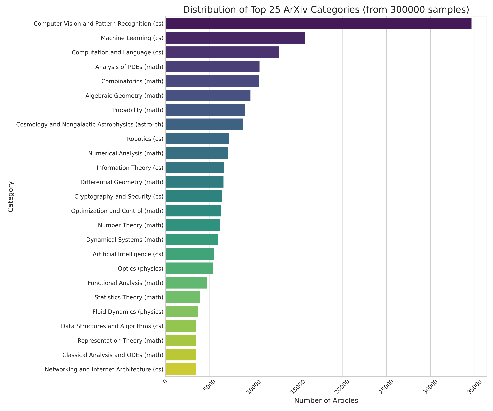
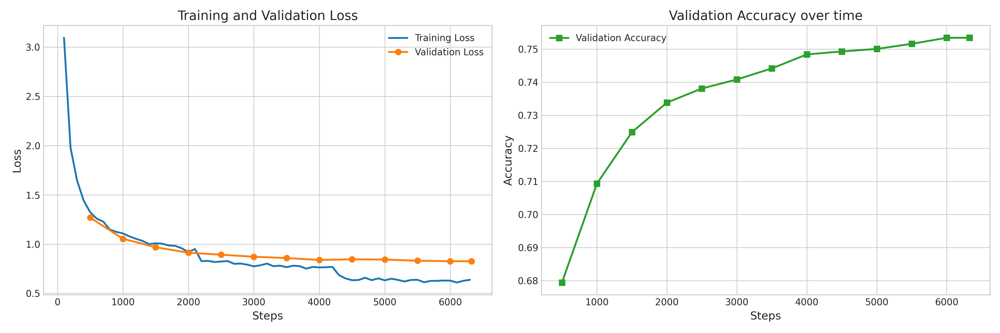

# ArXiv Paper Classification using Transformers

Данный репозиторий содержит енд-ту-енд сервис для классификации научных статей платформы arXiv.org. Проект включает в себя сбор данных, обучение Transformer и подготовку к развертыванию веб-интерфейса для инференса.

### Демонстрация работы сервиса
https://github.com/awesomeslayer/arxiv-classifier-transformers/raw/main/outputs/plots/example.mp4

<video src="outputs/plots/example.mp4" width="800"></video>

*(Если видео не отображается, вы можете найти его по пути: `outputs/plots/example.mp4`)*
## 1. Постановка задачи и данные

**Задача:** Построить классификатор научных статей. На вход модели подается название (Title) и аннотация (Abstract) статьи. На выходе модель должна предсказывать наиболее вероятные тематики статьи (например, физика, биология, computer science) с выдачей топ-95% наиболее вероятных категорий. Если аннотация отсутствует, классификация производится только по названию.

**Данные:** 
В качестве источника данных используется датасет `permutans/arxiv-papers-by-subject` из HuggingFace. Для ускорения загрузки и работы сети реализован скрипт `download/download.py`, который скачивает данные в формате `.parquet` напрямую в локальную директорию `arxiv_data`. Скрипт поддерживает возобновление загрузки и многопоточность, а также проксю потому что нынче тяжело с hf чет скачать нормально (но ее вставляйте сами в .env)

**Пример структуры данных:**
```json
{
  "title": "Attention Is All You Need",
  "abstract": "The dominant sequence transduction models are based on complex recurrent or convolutional neural networks...",
  "subjects": "Computation and Language (cs.CL); Machine Learning (cs.LG)"
}
```

### Анализ данных обучающей выборки

После загрузки датасета и отсечения редких классов (менее 50 примеров), мы получили следующие показатели на обучающей выборке:
* **Samples after filtering rare (<50) classes:** 299,905
* **Total unique classes:** 101

Как видно из статистики ниже, данные имеют сильный естественный дисбаланс (что типично для научных публикаций):

**--- Top 10 Most Common Classes ---**
```text
Computer Vision and Pattern Recognition (cs)         34637
Machine Learning (cs)                                15810
Computation and Language (cs)                        12802
Analysis of PDEs (math)                              10631
Combinatorics (math)                                 10588
Algebraic Geometry (math)                             9609
Probability (math)                                    9007
Cosmology and Nongalactic Astrophysics (astro-ph)     8755
Robotics (cs)                                         7148
Numerical Analysis (math)                             7110
```

**--- Top 10 Least Common Classes ---**
```text
Symbolic Computation (cs)                            331
Disordered Systems and Neural Networks (cond-mat)    284
Atomic and Molecular Clusters (physics)              260
Popular Physics (physics)                            215
Econometrics (econ)                                  215
Pattern Formation and Solitons (nlin)                201
Mathematical Software (cs)                           195
Cellular Automata and Lattice Gases (nlin)           144
Operating Systems (cs)                               127
Computational Finance (q-fin)                         63
```


*(График распределения топ-25 категорий датасета)*

## 2. Архитектура решения и результаты обучения

Для решения задачи дообучения (Fine-tuning) была выбрана модель `allenai/scibert_scivocab_uncased`. Выбор обусловлен тем, что SciBERT изначально предобучен на корпусе научных текстов (включая Semantic Scholar), что делает его идеальным базовым решением (baseline) для специфичной лексики arXiv.

**Параметры обучения:**
Выбиралось исходя из наличия времени на обучение, если будет время то в #TODO докачаю остальные топики архива а также поставлю побольше эпох чтобы было четко (но я так понял задача не про идеальный трейн а скорее инференс)

* **Объем выборки:** 300 000 статей (разделены на train/test в пропорции 90/10).
* **Количество классов:** 101 уникальная категория (после фильтрации редких классов).
* **Оборудование:** 1 x NVIDIA H100.
* **Время обучения:** ~1 час.
* **Гиперпараметры:** Batch Size = 128, Epochs = 3, Learning Rate = 3e-5, Weight Decay = 0.01, Mixed Precision = BF16.


**Результаты оценки (Test Metrics):**
* `eval_loss`: 0.8261
* `eval_accuracy`: 0.7533 (75.3%)
* `eval_f1`: 0.7452

Достигнутая точность (Accuracy ~75% и F1 ~74.5%) на датасете со 101 классом является имхо норм результ для 3 эпох обучения. Если еще накинуть данных, пуха и эпох то можно выбить побольше я уверен, но времени к сож не оч много на это остается.


*(График метрик обучения автоматически сохраняется в `outputs/plots/training_metrics.png`)*

## 3. Веб-интерфейс (Демонстрация)

Обученная модель интегрирована в веб-приложение для удобного тестирования инференса. Интерфейс позволяет ввести заголовок и абстракт статьи и получить отсортированный список предсказанных категорий.

**Ссылка на работающий сервис:** http://liq2hid.sbs
Важно: без VPN! 
(и сильно не дудосить на сервере не так много оперативы)

## 4. Инструкция по локальному запуску

Проект обернут в Docker для обеспечения полной воспроизводимости окружения.

### Шаг 1: Клонирование репозитория
```bash
git clone https://github.com/awesomeslayer/arxiv-classifier-transformers
cd arxiv-classifier-transformers
```

### Шаг 2: Настройка учетных данных и сборка образа
Перед запуском проверьте файл `credentials`. При необходимости замените `DOCKER_USER_ID` и `DOCKER_GROUP_ID` на ваши (можно узнать с помощью команды `id` в терминале хост-машины). Также убедитесь, что переменная `SRC` корректно указывает на путь к проекту:

```bash
#credentials
#! /bin/bash
DOCKER_NAME="nn_serov" # username in container
CONTAINER_NAME=$USER"-nn_serov" # name of container
SRC="/HFtune/" # source directory (supposedly, this repo's path is /home/${USER}/${SRC})

# to get these values type "id" in shell termilal
DOCKER_USER_ID=4200274
DOCKER_GROUP_ID=4200274
```

Запустите сборку Docker-образа:
```bash
chmod +x build
./build
```

### Шаг 3: Запуск контейнера
Скрипт `launch_container` прокидывает необходимые директории, выделяет GPU и запускает bash-сессию внутри контейнера.
```bash
chmod +x launch_container
./launch_container
```

Также вы можете создать .env с прокси и своим HF ключом чтобы все качалось четко и без ошибок 503 и тд:

```bash
#.env
PROXY_URL= #your
HF_ENDPOINT=https://hf-mirror.com
HF_TOKEN= #your
```

### Шаг 4: Загрузка данных
Находясь внутри контейнера, запустите скрипт загрузки датасета.
```bash
python download/download.py
```
*Примечание:* По умолчанию скрипт скачивает категории `cs`, `math`, `physics`. Чтобы добавить другие категории (например, `q-bio` или `stat`), отредактируйте список `domains` внутри файла `download/download.py`.

### Шаг 4.5: Анализ данных (Опционально)
Для воспроизведения анализа и генерации графика распределения данных запустите:
```bash
python analysis/data_analysis.py --samples 300000
```
Скрипт выведет статистику в консоль и сохранит график в `outputs/plots/data_distribution.png`.

### Шаг 5: Запуск обучения (Fine-Tuning)
После успешной загрузки данных можно запустить процесс обучения. Скрипт автоматически найдет все `.parquet` файлы, подготовит токенизатор и запустит Trainer.

```bash
python src/train.py \
    --gpu_id 0 \
    --samples 300000 \
    --batch_size 128 \
    --epochs 3 \
    --lr 3e-5 \
    --model_name "allenai/scibert_scivocab_uncased"
```

**Описание основных параметров:**
* `--gpu_id`: ID видеокарты, которая будет использоваться (CUDA_VISIBLE_DEVICES).
* `--samples`: Количество статей для загрузки из общего массива данных.
* `--batch_size`: Размер батча на одно устройство.
* `--epochs`: Количество эпох обучения.
* `--lr`: Скорость обучения (Learning Rate) для оптимизатора AdamW.
* `--model_name`: Имя базовой модели из каталога HuggingFace.

## 5. Результаты работы скриптов

После завершения обучения скрипт сгенерирует следующие артефакты:
* **`outputs/best_model/`** — директория с сохраненными весами лучшей модели (по метрике F1), конфигурацией и файлами токенизатора. Готова к загрузке через `AutoModelForSequenceClassification.from_pretrained()`.
* **`outputs/plots/training_metrics.png`** — график изменения функции потерь (Loss) на тренировочной и валидационной выборках, а также график роста Accuracy.
* **`outputs/model/`** — промежуточные чекпоинты (сохраняются каждые 500 шагов).

## 6. Запуск веб-интерфейса (Инференс)

После того как модель обучена и сохранена в `outputs/best_model/`, вы можете запустить интерактивный веб-интерфейс.

### Шаг 1: Подготовка окружения
Если вы запускаете интерфейс вне Docker-контейнера:
```bash
python3 -m venv venv
source venv/bin/activate
pip install -r requirements.txt
```

### Шаг 2: Запуск сервера
Приложение на FastAPI запускается через `uvicorn`. Скрипт подтянет веса из папки `outputs/best_model`.

```bash
uvicorn app:app --host 0.0.0.0 --port 8080
```

### Шаг 3: Доступ
Интерфейс будет доступен по адресу: `http://localhost:8080`. 
Реализована логика Top-95% Cumulative Confidence — модель выводит только те категории, суммарная вероятность которых дает 95% уверенности.

### Шаг 4: Работа в фоне
Для запуска на сервере в режиме 24/7:
```bash
nohup venv/bin/uvicorn app:app --host 0.0.0.0 --port 8080 > server.log 2>&1 &
```
